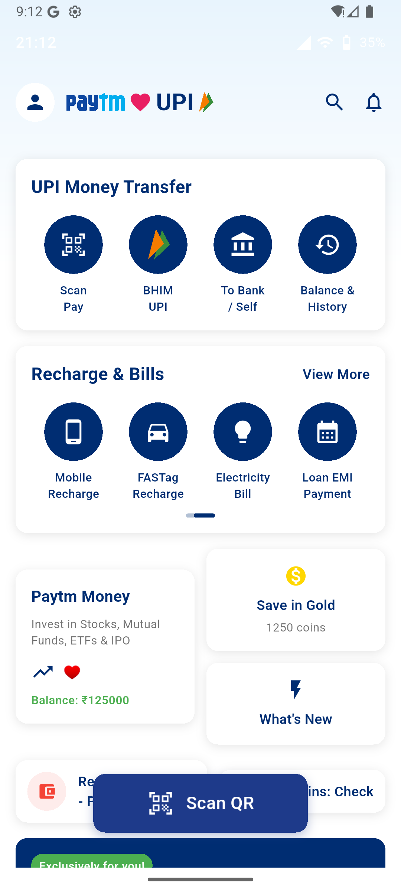
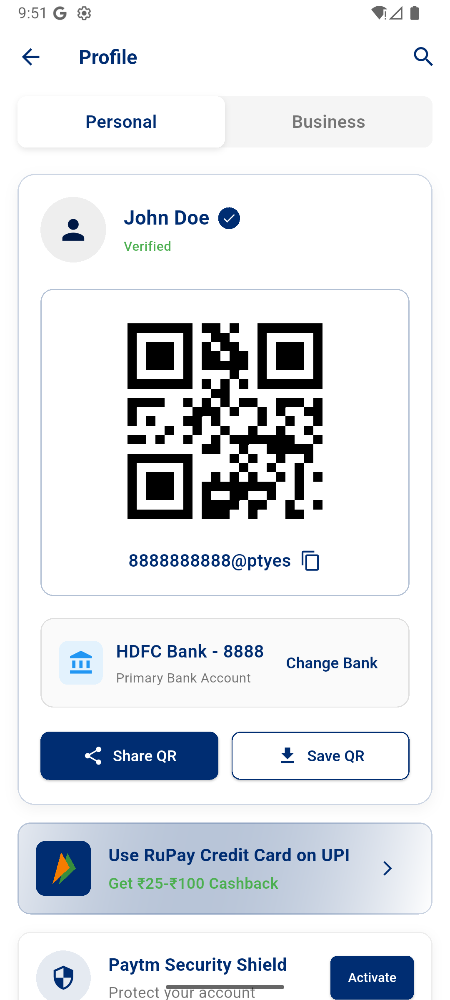
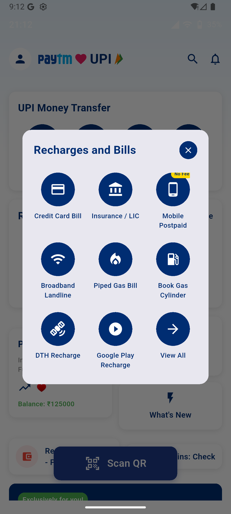
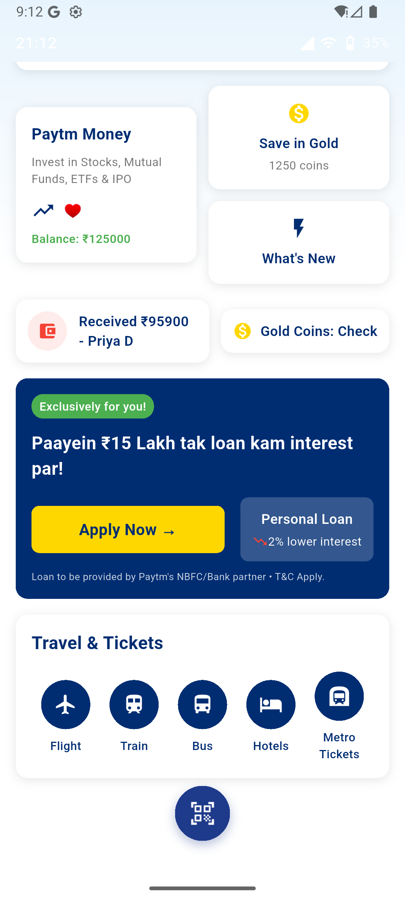

# Paytm UI Clone

A Flutter application that replicates the Paytm mobile app interface with dynamic content and modern UI design.

## Features

### 🏠 Home Screen
- **Dynamic Status Bar**: Real-time clock and battery level
- **Festive Banner**: "Happy Chhath Puja" themed banner with animated elements
- **UPI Money Transfer**: Quick access to scan & pay, mobile transfers, bank transfers, and balance history
- **Recharge & Bills**: Mobile recharge, FASTag, electricity bills, and loan EMI payments
- **Financial Services**: Paytm Money, Save in Gold, and What's New sections
- **Transaction Notifications**: Real-time transaction updates
- **Loan Banner**: Personalized loan offers with dynamic content
- **Travel & Tickets**: Flight, train, bus, hotels, and metro ticket bookings

### 📱 QR Code Screen
- **Personal QR Code**: Dynamic QR code generation for UPI payments
- **Profile Management**: User profile with verification status
- **Bank Account**: Current bank account details with change option
- **Action Buttons**: Share QR and Save QR functionality
- **RuPay Banner**: Credit card on UPI with cashback offers
- **Security Shield**: Account protection features

### ⚙️ Settings Screen
- **UPI & Payment Settings**: Centralized payment configuration
- **Menu Items**: Automatic payments, orders & bookings, profile, help & support, refer & win
- **Branding**: Paytm logo with "Made By India" tagline
- **Legal Information**: Terms & conditions, privacy policy, and app version

### 💳 Recharge & Bills Popup
- **Service Grid**: 3x3 grid of recharge and bill payment services
- **Dynamic Pricing**: "No Fee" tags for promotional services
- **Service Categories**: Credit cards, insurance, mobile, broadband, gas, DTH, Google Play

## Technical Features

### 🎨 UI/UX Design
- **Material Design 3**: Modern Material Design implementation
- **Custom Theme**: Paytm-inspired color scheme with gradients
- **Google Fonts**: Inter font family for consistent typography
- **Responsive Layout**: Adaptive design for different screen sizes
- **Smooth Animations**: Fluid transitions and interactions

### 🔄 Dynamic Content
- **Real-time Data**: Live clock, battery level, and transaction updates
- **User Profiles**: Dynamic user information and verification status
- **Transaction History**: Recent transaction notifications
- **Service Management**: Dynamic service availability and pricing
- **Personalized Offers**: Customized loan and cashback offers

### 🧭 Navigation
- **Bottom Navigation**: Home, Scan, Wallet, Profile tabs
- **Screen Transitions**: Smooth navigation between screens
- **Modal Dialogs**: Popup windows for additional services
- **Deep Linking**: Proper routing structure

## Project Structure

```
lib/
├── main.dart                 # App entry point
├── models/
│   └── user_data.dart        # Data models for user and transactions
├── data/
│   ├── models/               # Data models with code generation
│   ├── repositories/         # Data repositories
│   ├── services/            # Data services
│   └── viewmodels/         # View models
├── screens/
│   ├── home_screen.dart      # Main home screen
│   ├── qr_code_screen.dart   # QR code display screen
│   ├── profile_screen.dart   # User profile screen
│   └── settings_screen.dart  # Settings and profile screen
├── widgets/
│   ├── status_bar.dart       # Top status bar component
│   ├── header_section.dart   # App header with logo
│   ├── festive_banner.dart   # Festive theme banner
│   ├── upi_money_transfer_card.dart
│   ├── recharge_bills_card.dart
│   ├── recharge_bills_popup.dart
│   ├── financial_services_section.dart
│   ├── transaction_notifications.dart
│   ├── loan_banner.dart
│   ├── travel_tickets_section.dart
│   ├── floating_scan_button.dart
│   └── bottom_navigation.dart
├── services/
│   └── data_service.dart     # Data management service
├── theme/
│   └── app_theme.dart        # App theme configuration
└── utils/
    └── asset_helper.dart     # Asset management utilities
```

## Dependencies

- **flutter**: SDK
- **google_fonts**: ^6.2.1 - Typography
- **qr_flutter**: ^4.1.0 - QR code generation
- **intl**: ^0.19.0 - Internationalization

## Getting Started

1. **Clone the repository**
   ```bash
   git clone <repository-url>
   cd paytm_ui_clone
   ```

2. **Install dependencies**
   ```bash
   flutter pub get
   ```

3. **Run the app**
   ```bash
   flutter run
   ```

## Key Components

### Data Service
The `DataService` class provides dynamic content including:
- User profile information
- Recent transactions
- Service availability
- Real-time data (time, battery)
- Personalized offers

### Theme System
Custom theme implementation with:
- Paytm brand colors
- Gradient backgrounds
- Card decorations
- Typography styles
- Button themes

### Widget Architecture
Modular widget structure for:
- Reusability
- Maintainability
- Performance optimization
- Clean code organization

## Features Implemented

✅ **Complete Home Screen Layout**
✅ **QR Code Generation & Display**
✅ **Settings & Profile Management**
✅ **Recharge & Bills Popup**
✅ **Dynamic Content Integration**
✅ **Navigation System**
✅ **Custom Theme & Styling**
✅ **Responsive Design**
✅ **Real-time Data Updates**

## Future Enhancements

- [ ] Payment processing integration
- [ ] Real-time transaction updates
- [ ] Push notifications
- [ ] Offline support
- [ ] Multi-language support
- [ ] Dark mode theme
- [ ] Biometric authentication
- [ ] Advanced security features

## Screenshots

The app replicates the authentic Paytm interface with modern UI design and smooth user interactions:

### 🏠 Home Screen

- Clean white card layouts with Paytm brand colors
- UPI Money Transfer section with proper Material Icons
- Recharge & Bills card with service options
- Financial services cards (Paytm Money, Save in Gold)
- Travel & Tickets section
- Floating Scan QR button

### 📱 Profile Screen

- Personal/Business tab navigation
- User profile with verification status
- QR code display with UPI ID
- Bank account information
- RuPay UPI banner with BHIM integration
- Paytm Security Shield section

### 💳 Recharge & Bills Popup

- 3x3 grid of service options
- Clean modal design with proper spacing
- Service categories: Credit cards, insurance, mobile, broadband, gas, DTH, Google Play
- "No Fee" promotional tags

### 📱 Additional Screen

- Additional app functionality and features
- Enhanced user interface components
- Extended service options and navigation

### Key Design Features
- **Warm gradient backgrounds** matching Paytm's brand
- **Clean white card layouts** with subtle shadows
- **Paytm brand colors** (blue #002D72, light blue #00B9F1)
- **Dynamic content updates** with real-time data
- **Smooth user interactions** and animations
- **Material Design 3** implementation
- **Responsive design** for different screen sizes

## Contributing

1. Fork the repository
2. Create a feature branch
3. Commit your changes
4. Push to the branch
5. Create a Pull Request

## License

This project is for educational purposes and demonstrates Flutter UI development skills.# paytm-ui-clone
